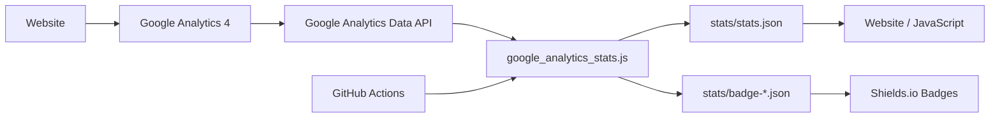

# GA4 GitHub Stats Publisher

A small **JavaScript / Node.js** project that reads aggregate **Google Analytics 4 (GA4)** metrics and publishes them to GitHub as reusable JSON files and Shields.io badge endpoints.

The goal is simple: keep Google credentials private in GitHub Secrets while exposing only safe aggregate statistics such as total users, sessions, and page views.

This can be used for:

- GitHub README analytics badges
- Portfolio website counters
- Personal dashboards
- Public project statistics
- JavaScript applications that need simple GA4 summary data

## How it works



## What it publishes

The JavaScript collector reads these GA4 aggregate metrics:

- `totalUsers`
- `activeUsers`
- `sessions`
- `screenPageViews`

It generates:

- Total users since your configured start date
- Total views since your configured start date
- Active users for the last 30 days
- Sessions for the last 30 days
- Views for the last 30 days
- Last successful update time

No IP addresses, emails, visitor identifiers, or user-level records are published.

## Repository structure

```text
.
├── .github/
│   └── workflows/
│       └── update-stats.yml
├── src/
│   └── google_analytics_stats.js
├── stats/
│   ├── stats.json
│   ├── badge-total-users.json
│   ├── badge-users-30d.json
│   ├── badge-sessions-30d.json
│   └── badge-views-30d.json
├── package.json
└── README.md
```

## Main JavaScript file

The main program is:

```text
src/google_analytics_stats.js
```

Its job is to:

1. Read the GA4 property ID from an environment variable.
2. Read the Google service-account credentials securely.
3. Connect to the Google Analytics Data API.
4. Request aggregate GA4 metrics.
5. Convert the response to simple JSON.
6. Write `stats/stats.json`.
7. Generate badge JSON files for Shields.io.

## Requirements

- Node.js 20 or newer
- A Google Analytics 4 property
- Google Analytics Data API enabled
- A Google Cloud service account
- Viewer access for that service account on the GA4 property

## Installation

Clone the repository:

```bash
git clone https://github.com/Motaibi1989/google-analytics-for-github.git
cd google-analytics-for-github
```

Install dependencies:

```bash
npm install
```

## Configuration

The script uses three environment variables.

| Variable | Required | Description |
|---|---:|---|
| `GA_PROPERTY_ID` | Yes | Numeric GA4 Property ID |
| `GOOGLE_SERVICE_ACCOUNT_JSON` | Yes | Full Google service-account JSON key |
| `GA_START_DATE` | No | Start date for all-time totals; default is `2020-10-14` |

Do **not** commit your Google service-account JSON key to the repository.

## Example: run the JavaScript file directly

You do not have to use npm scripts. After configuring the environment variables you can run the JavaScript file directly.

### PowerShell

```powershell
$env:GA_PROPERTY_ID = "123456789"
$env:GA_START_DATE = "2026-01-01"
$env:GOOGLE_SERVICE_ACCOUNT_JSON = Get-Content "C:\secure\service-account.json" -Raw

node .\src\google_analytics_stats.js
```

You can also use:

```powershell
npm run stats
```

or:

```powershell
npm start
```

### Linux / macOS

```bash
export GA_PROPERTY_ID="123456789"
export GA_START_DATE="2026-01-01"
export GOOGLE_SERVICE_ACCOUNT_JSON="$(cat /secure/service-account.json)"

node src/google_analytics_stats.js
```

## Example console output

The values below are examples only.

```text
Google Analytics statistics updated successfully.
{
  "source": "Google Analytics 4",
  "updated_at_utc": "2026-08-10T12:00:00.000Z",
  "all_time": {
    "start_date": "2026-01-01",
    "end_date": "yesterday",
    "total_users": 1842,
    "views": 6241
  },
  "last_30_days": {
    "start_date": "30daysAgo",
    "end_date": "yesterday",
    "active_users": 327,
    "sessions": 481,
    "views": 1035
  }
}
```

## Generated JSON output

The main generated file is:

```text
stats/stats.json
```

Example:

```json
{
  "source": "Google Analytics 4",
  "updated_at_utc": "2026-08-10T12:00:00.000Z",
  "all_time": {
    "start_date": "2026-01-01",
    "end_date": "yesterday",
    "total_users": 1842,
    "views": 6241
  },
  "last_30_days": {
    "start_date": "30daysAgo",
    "end_date": "yesterday",
    "active_users": 327,
    "sessions": 481,
    "views": 1035
  }
}
```

## Example: use the generated data in JavaScript

Because `stats/stats.json` is stored in the public repository, another website can read it without needing access to your Google credentials.

### Simple JavaScript example

```html
<div>
  Total users: <strong id="total-users">Loading...</strong>
</div>

<script>
const statsUrl =
  'https://raw.githubusercontent.com/Motaibi1989/google-analytics-for-github/main/stats/stats.json';

fetch(statsUrl)
  .then(response => {
    if (!response.ok) {
      throw new Error(`HTTP ${response.status}`);
    }

    return response.json();
  })
  .then(stats => {
    document.getElementById('total-users').textContent =
      stats.all_time.total_users.toLocaleString();
  })
  .catch(error => {
    console.error('Unable to load analytics:', error);
    document.getElementById('total-users').textContent = 'Unavailable';
  });
</script>
```

Example displayed result:

```text
Total users: 1,842
```

## Example: analytics dashboard with JavaScript

```html
<div id="ga-stats">Loading analytics...</div>

<script>
async function loadGoogleAnalyticsStats() {
  const url =
    'https://raw.githubusercontent.com/Motaibi1989/google-analytics-for-github/main/stats/stats.json';

  const response = await fetch(url);

  if (!response.ok) {
    throw new Error(`Unable to load stats: HTTP ${response.status}`);
  }

  const stats = await response.json();

  document.getElementById('ga-stats').innerHTML = `
    <p>Total users: ${stats.all_time.total_users.toLocaleString()}</p>
    <p>Total views: ${stats.all_time.views.toLocaleString()}</p>
    <p>Users - last 30 days: ${stats.last_30_days.active_users.toLocaleString()}</p>
    <p>Sessions - last 30 days: ${stats.last_30_days.sessions.toLocaleString()}</p>
    <p>Views - last 30 days: ${stats.last_30_days.views.toLocaleString()}</p>
  `;
}

loadGoogleAnalyticsStats().catch(error => {
  console.error(error);
  document.getElementById('ga-stats').textContent = 'Analytics unavailable';
});
</script>
```

Example displayed result:

```text
Total users: 1,842
Total views: 6,241
Users - last 30 days: 327
Sessions - last 30 days: 481
Views - last 30 days: 1,035
```

## Example: use the JSON from another Node.js application

Node.js 20+ includes `fetch()`.

```js
const url =
  'https://raw.githubusercontent.com/Motaibi1989/google-analytics-for-github/main/stats/stats.json';

const response = await fetch(url);

if (!response.ok) {
  throw new Error(`HTTP ${response.status}`);
}

const stats = await response.json();

console.log('Total users:', stats.all_time.total_users);
console.log('Total views:', stats.all_time.views);
console.log('30-day sessions:', stats.last_30_days.sessions);
```

Example output:

```text
Total users: 1842
Total views: 6241
30-day sessions: 481
```

## GitHub badges

The repository generates Shields.io endpoint JSON automatically.


Example badge file:

```json
{
  "schemaVersion": 1,
  "label": "Total users",
  "message": "1,842"
}
```

## GitHub Actions setup

In the repository open:

**Settings → Secrets and variables → Actions**

Create this secret:

```text
GOOGLE_SERVICE_ACCOUNT_JSON
```

Create this variable:

```text
GA_PROPERTY_ID
```

Optional variable:

```text
GA_START_DATE
```

Then open:

**Actions → Update Google Analytics stats → Run workflow**

The workflow also runs automatically every day.

## Security

- Service-account credentials remain in GitHub Secrets.
- The service account should have only Viewer access to GA4.
- The GA4 Property ID is not a password or secret.
- Only aggregate values stored in `stats/` become public.
- Visitor-level details are not written to GitHub.

## Project summary

**Name:** GA4 GitHub Stats Publisher  
**Language:** JavaScript / Node.js  
**Data source:** Google Analytics 4 Data API  
**Automation:** GitHub Actions  
**Output:** JSON statistics and Shields.io badge endpoints

This project provides a lightweight bridge between **Google Analytics 4**, **GitHub**, and any website or JavaScript application that needs simple public analytics counters.
