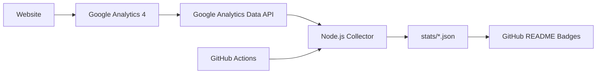

# Google Analytics for GitHub

Publish selected **Google Analytics 4 (GA4)** website statistics to GitHub automatically using **JavaScript / Node.js**.

This project reads public-safe aggregate metrics from the Google Analytics Data API, writes them to JSON files, and updates GitHub badges with GitHub Actions. Your Google service-account credentials stay in GitHub Secrets and are never committed to the repository.

## What it publishes

- Total users since the configured start date
- Active users in the last 30 complete days
- Sessions in the last 30 complete days
- Page/screen views in the last 30 complete days
- Last successful update time

## Public badges


The badges initially show `setup required`. After configuration and the first successful workflow run, they display live GA4-derived aggregate statistics.

## How it works



## Repository structure

```text
.
├── .github/
│   └── workflows/
│       └── update-stats.yml
├── src/
│   └── fetch_ga4.js
├── stats/
│   ├── stats.json
│   ├── badge-total-users.json
│   ├── badge-users-30d.json
│   ├── badge-sessions-30d.json
│   └── badge-views-30d.json
├── .gitignore
├── package.json
└── README.md
```

## Requirements

- Node.js 20 or newer
- A GA4 property
- Google Analytics Data API enabled
- Google Cloud service account with Viewer access to the GA4 property

## Setup

### 1. Enable the Google Analytics Data API

In Google Cloud, select or create a project and enable **Google Analytics Data API**.

Official documentation:
https://developers.google.com/analytics/devguides/reporting/data/v1/quickstart

### 2. Create a service account

Create a Google Cloud service account and generate a JSON key for it.

Use the minimum access required. The service account only needs read access to the GA4 property.

### 3. Grant the service account access to GA4

In Google Analytics:

1. Open **Admin**.
2. Open the required GA4 **Property**.
3. Open **Property access management**.
4. Add the service account email.
5. Grant **Viewer** access.

### 4. Add the GitHub configuration

In this repository, open:

**Settings → Secrets and variables → Actions**

Create this repository **secret**:

| Name | Type | Value |
|---|---|---|
| `GOOGLE_SERVICE_ACCOUNT_JSON` | Secret | Entire service-account JSON key |

Create this repository **variable**:

| Name | Type | Value |
|---|---|---|
| `GA_PROPERTY_ID` | Variable | Numeric GA4 Property ID |

Optional variable:

| Name | Type | Default | Description |
|---|---|---|---|
| `GA_START_DATE` | Variable | `2020-10-14` | First date used for the total-users statistic |

Do **not** commit a service-account JSON key to this repository.

### 5. Install dependencies locally

```bash
npm install
```

### 6. Run locally

Linux/macOS example:

```bash
export GA_PROPERTY_ID="123456789"
export GA_START_DATE="2026-01-01"
export GOOGLE_SERVICE_ACCOUNT_JSON='{"type":"service_account","project_id":"example",...}'
npm run stats
```

PowerShell example:

```powershell
$env:GA_PROPERTY_ID="123456789"
$env:GA_START_DATE="2026-01-01"
$env:GOOGLE_SERVICE_ACCOUNT_JSON=Get-Content .\service-account.json -Raw
npm run stats
```

For local testing, keep `service-account.json` outside the repository or ensure it is ignored by Git.

### 7. Run in GitHub Actions

Open:

**Actions → Update Google Analytics stats → Run workflow**

The workflow also runs automatically once per day.

## Example console output

Example values below are illustrative. Your real values come from your GA4 property.

```text
> google-analytics-for-github@1.0.0 stats
> node src/fetch_ga4.js

Google Analytics statistics updated successfully.
{
  "source": "Google Analytics 4",
  "updated_at_utc": "2026-08-10T10:30:00.000Z",
  "all_time": {
    "start_date": "2026-01-01",
    "end_date": "yesterday",
    "total_users": 1842,
    "views": 6241
  },
  "last_30_days": {
    "start_date": "30daysAgo",
    "end_date": "yesterday",
    "active_users": 327,
    "sessions": 481,
    "views": 1035
  }
}
```

## Output files

### `stats/stats.json`

This is the main machine-readable file. A portfolio website or another application can consume it directly.

Example:

```json
{
  "source": "Google Analytics 4",
  "updated_at_utc": "2026-08-10T10:30:00.000Z",
  "all_time": {
    "start_date": "2026-01-01",
    "end_date": "yesterday",
    "total_users": 1842,
    "views": 6241
  },
  "last_30_days": {
    "start_date": "30daysAgo",
    "end_date": "yesterday",
    "active_users": 327,
    "sessions": 481,
    "views": 1035
  }
}
```

### Badge output example

`stats/badge-total-users.json`:

```json
{
  "schemaVersion": 1,
  "label": "Total users",
  "message": "1,842"
}
```

`stats/badge-sessions-30d.json`:

```json
{
  "schemaVersion": 1,
  "label": "Sessions (30d)",
  "message": "481"
}
```

These JSON files are used by Shields.io to render the README badges.

## JavaScript usage examples

### Example 1: Show total users on a website

```html
<div>Total visitors: <strong id="ga-total-users">Loading...</strong></div>

<script>
fetch('https://raw.githubusercontent.com/Motaibi1989/google-analytics-for-github/main/stats/stats.json')
  .then(response => response.json())
  .then(stats => {
    document.getElementById('ga-total-users').textContent =
      stats.all_time.total_users.toLocaleString();
  })
  .catch(() => {
    document.getElementById('ga-total-users').textContent = 'Unavailable';
  });
</script>
```

Example rendered output:

```text
Total visitors: 1,842
```

### Example 2: Show a small analytics summary

```html
<ul id="analytics-summary"></ul>

<script>
async function loadAnalytics() {
  const response = await fetch(
    'https://raw.githubusercontent.com/Motaibi1989/google-analytics-for-github/main/stats/stats.json'
  );

  const stats = await response.json();

  document.getElementById('analytics-summary').innerHTML = `
    <li>Total users: ${stats.all_time.total_users.toLocaleString()}</li>
    <li>30-day users: ${stats.last_30_days.active_users.toLocaleString()}</li>
    <li>30-day sessions: ${stats.last_30_days.sessions.toLocaleString()}</li>
    <li>30-day views: ${stats.last_30_days.views.toLocaleString()}</li>
  `;
}

loadAnalytics();
</script>
```

Example rendered output:

```text
Total users: 1,842
30-day users: 327
30-day sessions: 481
30-day views: 1,035
```

### Example 3: Read the JSON from Node.js

Node.js 20+ includes `fetch()`:

```js
const url = 'https://raw.githubusercontent.com/Motaibi1989/google-analytics-for-github/main/stats/stats.json';

const response = await fetch(url);
const stats = await response.json();

console.log('Total users:', stats.all_time.total_users);
console.log('Views (30d):', stats.last_30_days.views);
```

Example output:

```text
Total users: 1842
Views (30d): 1035
```

## Use the statistics on another website

Because this repository is public, a website can read the generated raw JSON file and render the values. Only the aggregate values written to `stats/` are public; the Google credentials remain private in GitHub Secrets.

Raw stats file:

```text
https://raw.githubusercontent.com/Motaibi1989/google-analytics-for-github/main/stats/stats.json
```

## Security design

- Google credentials are stored only in GitHub Secrets.
- The GA4 Property ID is stored as a GitHub variable; it is not a credential.
- The service account should have read-only GA4 access.
- The workflow grants `contents: write` only because it must commit refreshed `stats/` files.
- No visitor-level data, IP addresses, emails, or user identifiers are published.

## Metrics

The collector uses official GA4 Data API metrics:

- `totalUsers`
- `activeUsers`
- `sessions`
- `screenPageViews`

Google Analytics Data API documentation:
https://developers.google.com/analytics/devguides/reporting/data/v1

Metrics reference:
https://developers.google.com/analytics/devguides/reporting/data/v1/api-schema

## Status

Project scaffold: **ready**  
Runtime: **JavaScript / Node.js**  
GA4 connection: **requires repository configuration**
