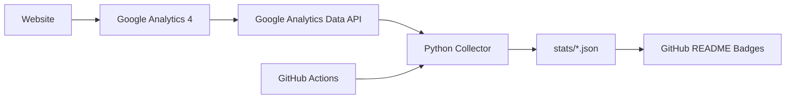

# Google Analytics for GitHub

Publish selected **Google Analytics 4 (GA4)** website statistics to GitHub automatically.

This project reads public-safe aggregate metrics from the Google Analytics Data API, writes them to JSON files, and updates GitHub badges with GitHub Actions. Your Google service-account credentials stay in GitHub Secrets and are never committed to the repository.

## What it publishes

- Total users since the configured start date
- Active users in the last 30 complete days
- Sessions in the last 30 complete days
- Page/screen views in the last 30 complete days
- Last successful update time

## Public badges


The badges initially show `setup required`. After configuration and the first successful workflow run, they display live GA4-derived aggregate statistics.

## How it works



## Repository structure

```text
.
├── .github/
│   └── workflows/
│       └── update-stats.yml
├── src/
│   └── fetch_ga4.py
├── stats/
│   ├── stats.json
│   ├── badge-total-users.json
│   ├── badge-users-30d.json
│   ├── badge-sessions-30d.json
│   └── badge-views-30d.json
├── .gitignore
├── requirements.txt
└── README.md
```

## Setup

### 1. Enable the Google Analytics Data API

In Google Cloud, select or create a project and enable **Google Analytics Data API**.

Official documentation:
https://developers.google.com/analytics/devguides/reporting/data/v1/quickstart

### 2. Create a service account

Create a Google Cloud service account and generate a JSON key for it.

Use the minimum access required. The service account only needs read access to the GA4 property.

### 3. Grant the service account access to GA4

In Google Analytics:

1. Open **Admin**.
2. Open the required GA4 **Property**.
3. Open **Property access management**.
4. Add the service account email.
5. Grant **Viewer** access.

### 4. Add the GitHub configuration

In this repository, open:

**Settings → Secrets and variables → Actions**

Create this repository **secret**:

| Name | Type | Value |
|---|---|---|
| `GOOGLE_SERVICE_ACCOUNT_JSON` | Secret | Entire service-account JSON key |

Create this repository **variable**:

| Name | Type | Value |
|---|---|---|
| `GA_PROPERTY_ID` | Variable | Numeric GA4 Property ID |

Optional variable:

| Name | Type | Default | Description |
|---|---|---|---|
| `GA_START_DATE` | Variable | `2020-10-14` | First date used for the total-users statistic |

Do **not** commit a service-account JSON key to this repository.

### 5. Run it

Open:

**Actions → Update Google Analytics stats → Run workflow**

The workflow also runs automatically once per day.

## Output

`stats/stats.json` is machine-readable and can also be consumed by a portfolio website:

```json
{
  "source": "Google Analytics 4",
  "updated_at_utc": "2026-08-08T00:00:00+00:00",
  "all_time": {
    "start_date": "2020-10-14",
    "end_date": "yesterday",
    "total_users": 0,
    "views": 0
  },
  "last_30_days": {
    "active_users": 0,
    "sessions": 0,
    "views": 0
  }
}
```

## Use the statistics on another website

Because this repository is public, a website can read the generated raw JSON file and render the values. Only the aggregate values written to `stats/` are public; the Google credentials remain private in GitHub Secrets.

Raw stats file:

```text
https://raw.githubusercontent.com/Motaibi1989/google-analytics-for-github/main/stats/stats.json
```

## Security design

- Google credentials are stored only in GitHub Secrets.
- The GA4 Property ID is stored as a GitHub variable; it is not a credential.
- The service account should have read-only GA4 access.
- The workflow grants `contents: write` only because it must commit refreshed `stats/` files.
- No visitor-level data, IP addresses, emails, or user identifiers are published.

## Metrics

The collector uses official GA4 Data API metrics:

- `totalUsers`
- `activeUsers`
- `sessions`
- `screenPageViews`

Google Analytics Data API documentation:
https://developers.google.com/analytics/devguides/reporting/data/v1

Metrics reference:
https://developers.google.com/analytics/devguides/reporting/data/v1/api-schema

## Status

Project scaffold: **ready**  
GA4 connection: **requires repository configuration**
